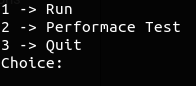
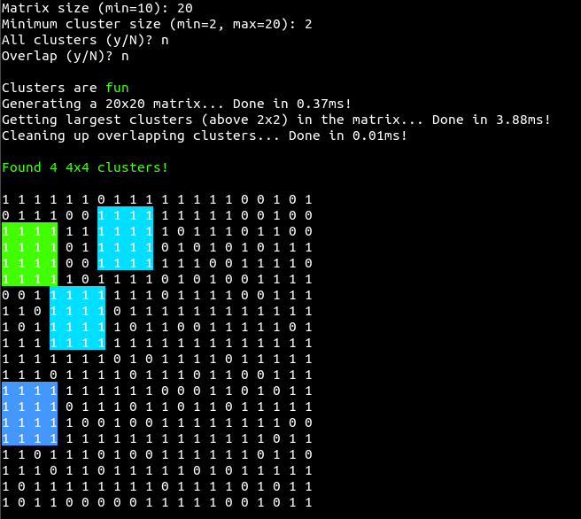
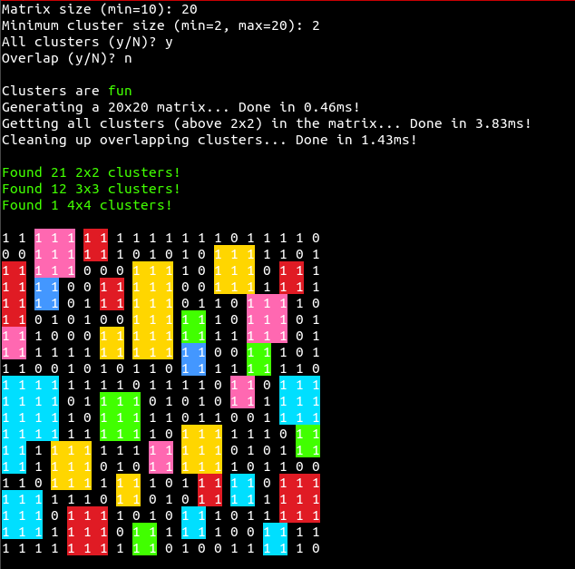
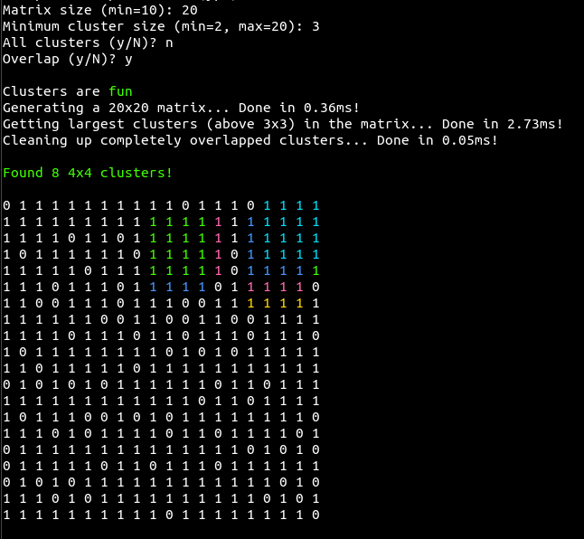
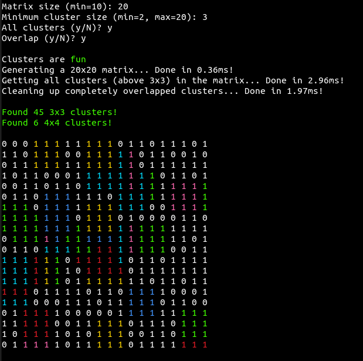

# ClusterDetection

### Find the largest square cluster in a matrix.

## Exercise

**1. Create the matrix**
* The matrix should be a 2D array consisting of two randomly distributed values or characters, e.g. 'X' and 'O'. 
* Being able to change the ratio of the values could be advantageous. 

**2. Find the clusters**
* Find the positions and sizes of all square submatrices of a certain minimum size that only contain one of the characters. 
* Ideally, clusters should not intersect. 

**3. Print the result**
* Print the matrix and highlight the largest cluster by changing the text color. 
* If more than one cluster of that size is present, highlight all of them. 
* Optionally printing a summary would make sense.

**4. Performance test** [optional]
* Measure the runtime of each function. 
* Test the functions with different parameters and see how well they scale.

# My solution
Starting the program you will be greeted with a small menu. 

## Menu options
**Run once:** Creates one random matrix, finds square clusters and prints the results.

**Performance test:** Executes a set of test cases, calculates the average runtimes and prints out the timings.

**Quit:** Ends the program.

## Function Parameters
**Run once:**
* Size of the matrix
* Enable highlighting all clusters
* Enable overlapping
* Minimum cluster size to be recognized
* Factors to vary the probability of both matrix elements

**Performance test:**
* Amount of test cases
* Runs per case
* Size of the matrix at the start
* Size increment for every new case

## Examples

### Multiple large clusters

### Show all clusters

### Overlap enabled (largest clusters only)

### Overlap enabled (all clusters)

